# MealFlow

<p align="center">
  
</p>

MealFlow is a full-stack recipe management application built with Django, designed to inspire home cooking and make everyday meal planning a little easier.

Users can browse, search and filter recipes, view complete recipe details and discover new favourites. By creating an account, users can save recipes to their personal collection, share their own recipes with the community, and edit or delete the recipes they have created — keeping everything organised in one convenient place.


## Live Site 

- [View the live MealFlow website](https://mealflow-c8de861cd143.herokuapp.com/)

---

## Table of Contents

- [User Experience](#user-experience)
  - [Strategy Plane](#strategy-plane)
  - [Scope Plane](#scope-plane)
  - [Structure Plane](#structure-plane)
  - [Skeleton Plane](#skeleton-plane)
  - [Surface Plane](#surface-plane)
- [User Stories](#user-stories)
- [Wireframes](#wireframes)
- [Features](#features)
  - [Existing Features](#existing-features)
  - [Future Features](#future-features)
- [Data Model](#data-model)
- [Technologies Used](#technologies-used)
- [Testing](#testing)
- [Bugs](#bugs)
- [Deployment](#deployment)
- [Local Development](#local-development)
  - [Cloning](#cloning)
  - [Forking](#forking)
- [Credits](#credits)
- [Acknowledgements](#acknowledgements)

---

# User Experience

## Strategy Plane

### Purpose

MealFlow provides a simple and accessible place for users to discover, save and manage recipes.
The application allows visitors to browse, search and filter recipes, while registered users can save favourites and create, edit or delete their own recipes.

The main purpose of the application is to:

- Allow visitors to browse available recipes.
- Help users find suitable recipes through search and filtering.
- Present recipe information in a clear and readable format.
- Allow registered users to save recipes for later.
- Allow users to create and manage their own recipes.
- Provide clear feedback after important actions.

### Primary User Needs

Users should be able to:

- Understand the purpose of the application quickly.
- Browse and view recipes without an account.
- Search and filter recipes easily.
- View clear ingredient lists and instructions.
- Register, log in and manage their account securely.
- Save recipes and manage their own contributions.
- Receive clear feedback after important actions.
- Use the application across mobile, tablet and desktop devices.

### Project Goals

The main goals for MealFlow were to:

- Build a full-stack Django application using a relational database.
- Implement user authentication and complete CRUD functionality.
- Allow registered users to save recipes to a personal collection.
- Restrict recipe editing and deletion to the recipe author.
- Implement recipe search and filtering.
- Create an accessible, responsive and intuitive interface.
- Deploy the finished application to Heroku.

---

## Scope Plane

---
## Wireframes

An initial wireframe was created in **Lucidchart** for the Home page to establish the overall structure, including the header, search and filter area, recipe grid and main call-to-action elements.

The final design evolved during development as functionality and responsive behaviour were implemented. Additional pages were created using the Home page wireframe as a visual reference, with consistent navigation, buttons, forms, spacing and card styles throughout the application.

Although some details differ from the original wireframe, the core layout and design direction were retained.

*Initial Home page wireframe created in Lucidchart.*

<table>
  <tr>
    <th>Mobile</th>
    <th>Tablet</th>
    <th>Desktop</th>
  </tr>
  <tr>
    <td>
      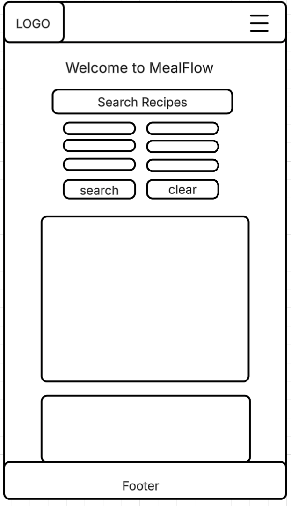
    </td>
    <td>
      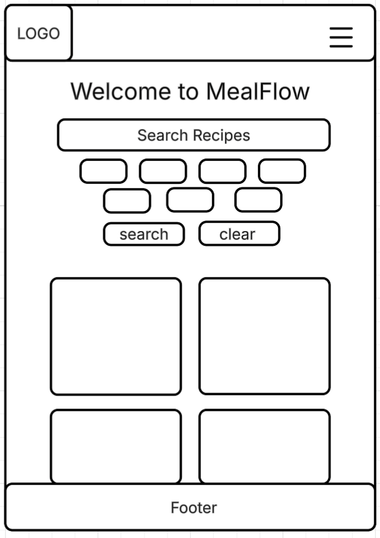
    </td>
    <td>
      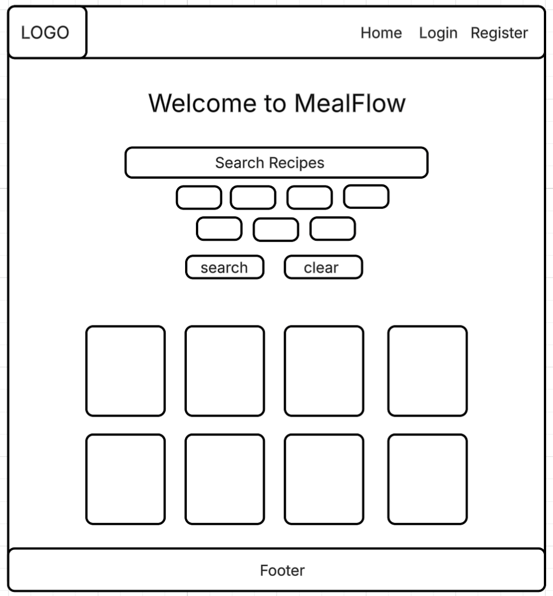
    </td>
  </tr>
</table>

---

### Core Features

MealFlow includes:

- Public recipe browsing with search, filters and load-more functionality.
- Detailed recipe pages with ingredients and instructions.
- User registration, login and logout.
- Saved recipe collections for registered users.
- Full recipe CRUD for authenticated users.
- Authorisation checks for editing and deleting recipes.
- Responsive navigation and recipe layouts.
- Success messages and toast-style feedback.
- Django admin management.

### Recipe Content

Each recipe includes:

- Title and description.
- Meal type and food category.
- Servings and cooking time.
- Recipe image.
- Ingredients and ordered instructions.
- Author and timestamps.

## Features

### Information Architecture

The main areas of the application are:

#### Home Page

- The Home page is the main landing page for MealFlow. It introduces the purpose of the application and gives users immediate access to the available recipe collection. The page includes the MealFlow logo, responsive navigation, a search and filter form, and a responsive grid of recipe cards.

<p align="center">
  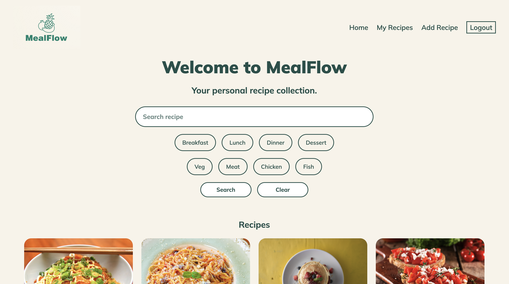
</p>

- Users can search for recipes by entering a title in the search field. Recipes can also be filtered by meal type and food category using checkbox-style filter buttons. The recipe grid updates immediately when a filter is selected, allowing users to combine multiple options and quickly narrow down the results. The **Clear** button resets the search field and all selected filters.

<p align="center">
  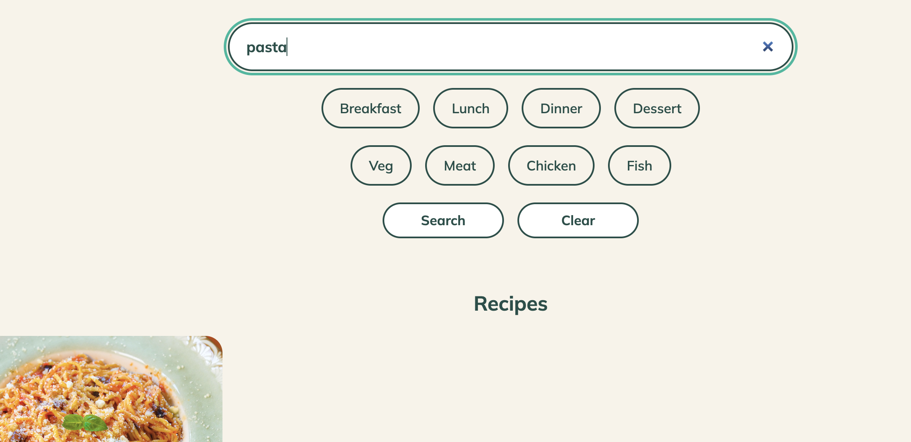
</p>

<p align="center">
  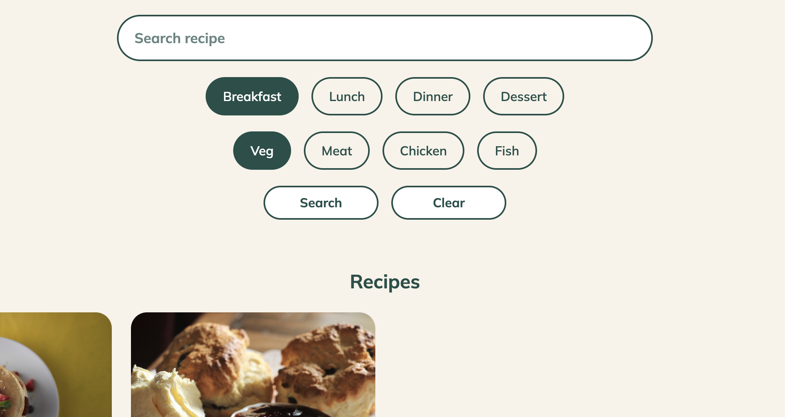
</p>


- Each recipe is presented as a card containing an image, title and category. Selecting a card opens the corresponding Recipe Details page, where the user can view the complete recipe. Up to 16 matching recipes are displayed initially. When more recipes are available, a **Load More** button appears and displays the next group of up to 16 recipes.

<p align="center">
  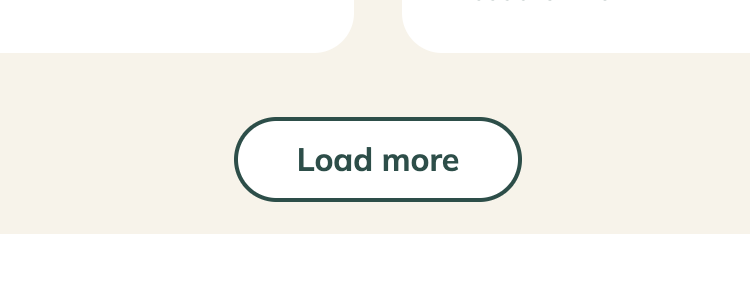
</p>

- The navigation changes according to the user's authentication status. Visitors can access **Home**, **Register** and **Login**. Authenticated users instead have access to **Home**, **My Recipes**, **Add Recipe** and **Logout**. On smaller screens, the navigation is presented through a hamburger menu to keep the header clear and accessible.

#### Recipe Details Page

Selecting a recipe card opens the corresponding Recipe Details page, where the full recipe is displayed.
The page includes the recipe image, description and key information such as food category, cooking time and number of servings. This is followed by a complete ingredient list and step-by-step cooking instructions.

<p align="center">
  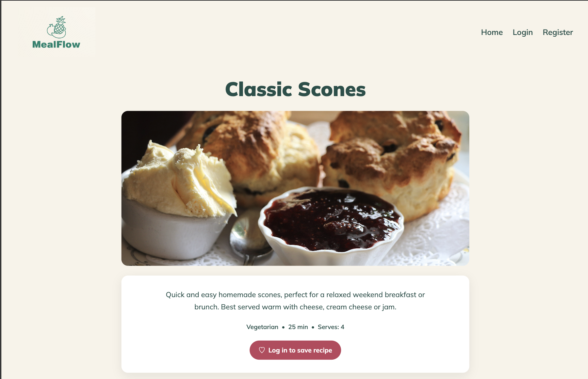
</p>

<p align="center">
  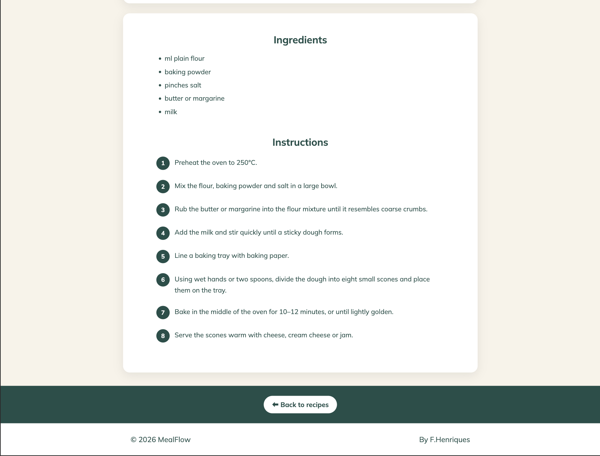
</p>

- The save action changes depending on the user's authentication status. Visitors see a **Log in to save recipe** button, while authenticated users see **Save recipe**. When a recipe is saved, the button changes to **Saved** and a toast message confirms that it has been added to the user's saved recipes. Selecting the button again removes the recipe, restores the **Save recipe** label and displays a confirmation message.

- A **Back to recipes** button is shown at the bottom of the page. When the logged-in user is also the author of the recipe, an additional **Edit recipe** button is displayed, allowing them to update or delete their recipe.

#### Registration Page

Selecting **Register** in the navigation opens the Registration page, where visitors can create an account using Django's built-in `UserCreationForm`.

<p align="center">
  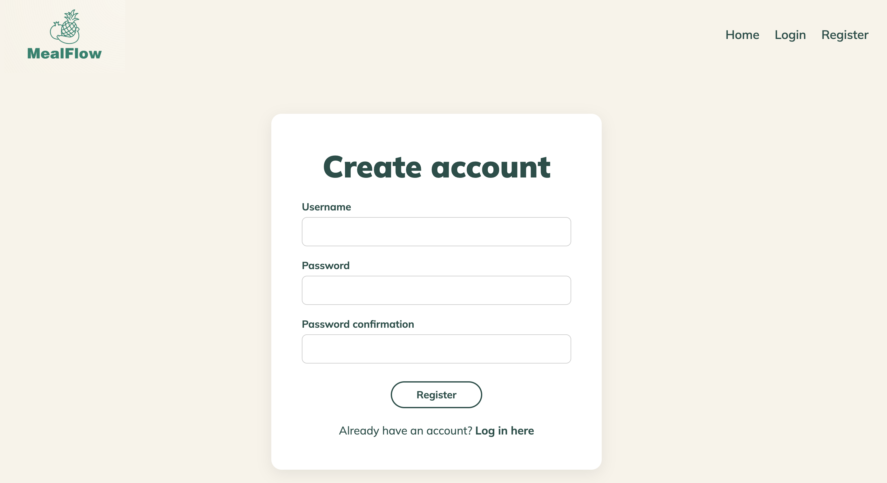
</p>

The form requires a username, password and password confirmation. Django validates the submitted information and displays error messages when the username is unavailable, the passwords do not match or the password does not meet the required security rules.

<p align="center">
  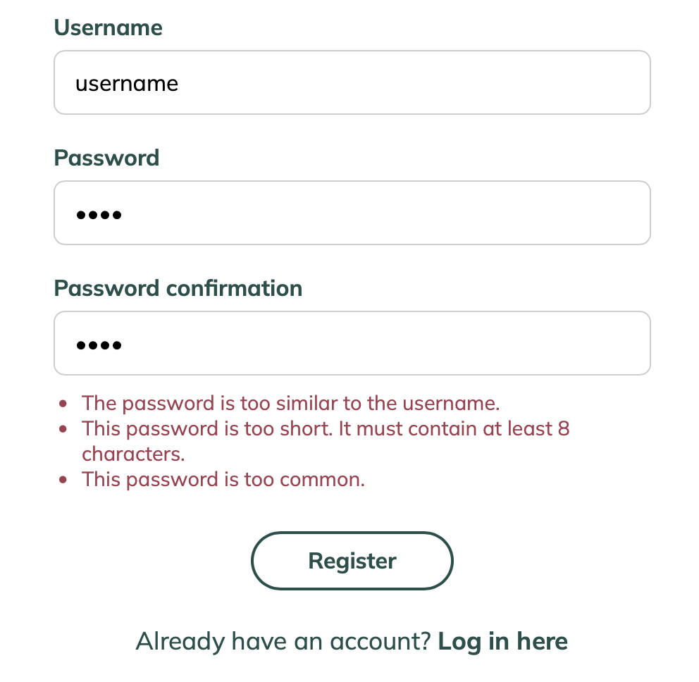
</p>

Users who already have an account can follow the **Already have an account? Log in here** link to open the Login page.
After successful registration, the user is logged in automatically and redirected to the Home page.

#### Login Page

The Login page uses the same clean and consistent styling as the Registration page. Existing users can enter their username and password to access authenticated features such as saving recipes and managing their own recipe contributions.

<p align="center">
  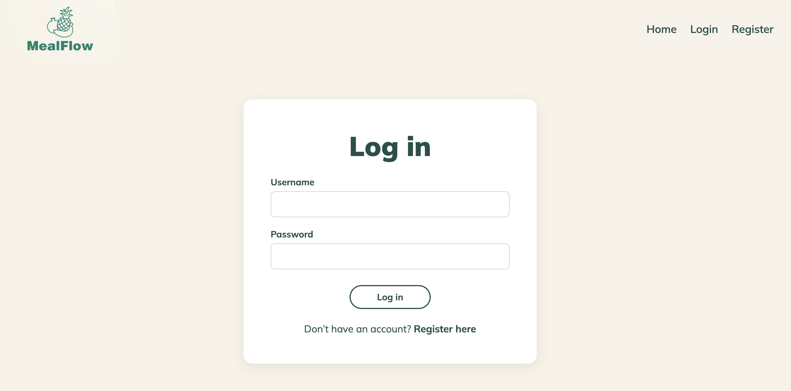
</p>

If the submitted username or password is incorrect, the form displays an error message and the user remains on the page.

<p align="center">
  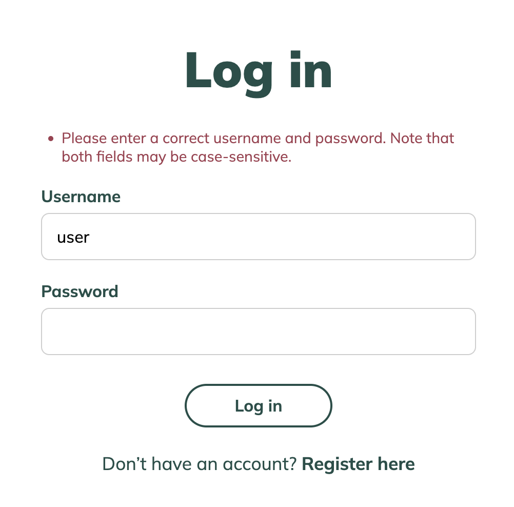
</p>

Visitors who do not yet have an account can follow the **Don't have an account? Register here** link to open the Registration page.

#### My Recipes Page

The **My Recipes** page is available to authenticated users and provides a personal overview of both saved and created recipes.

Saved recipes and recipes created by the user are displayed in separate sections using the same responsive recipe-card layout as the Home page. Selecting a card opens the corresponding Recipe Details page.

Saved recipes: 
<p align="center">
  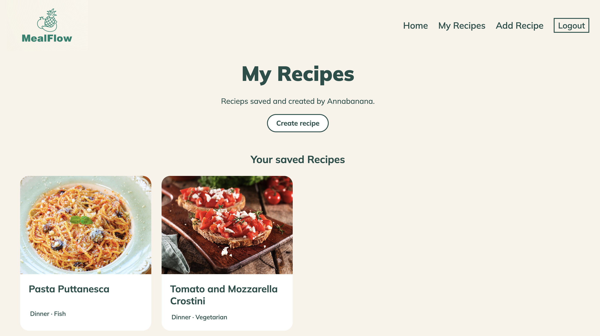
</p>

Created recipes: 
<p align="center">
  
</p>

When either section is empty, a clear message is displayed:

- **You have not saved any recipes yet.**
- **You have not created any recipes yet.**

<p align="center">
  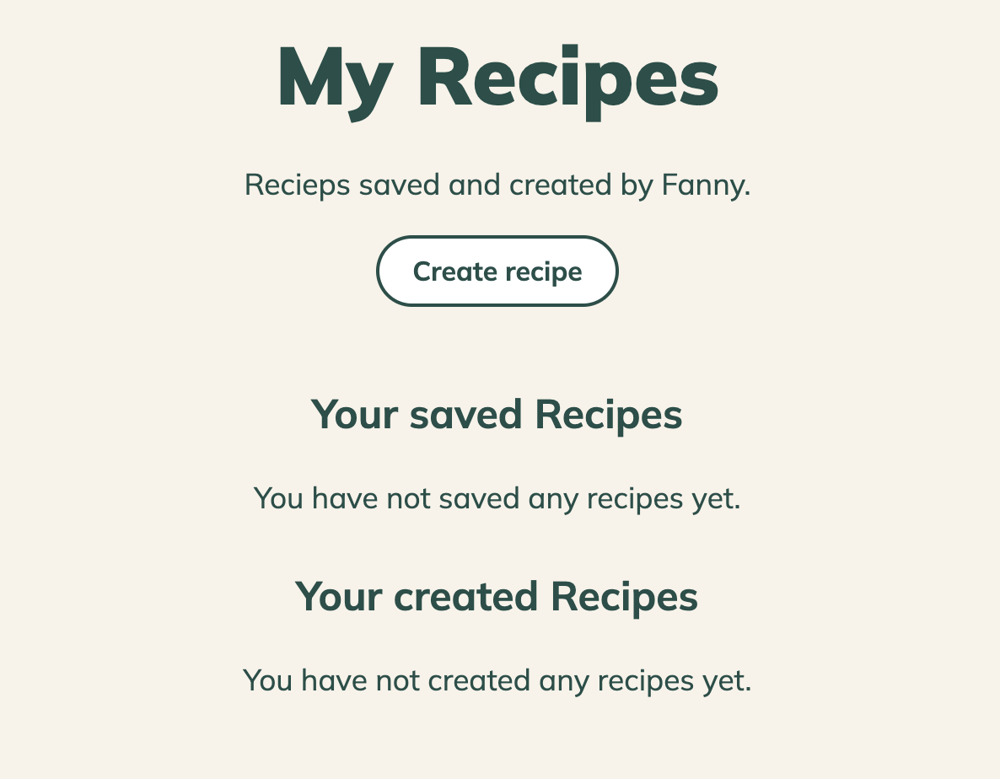
</p>

A **Create recipe** button is displayed near the top of the page and links directly to the Create Recipe page.

#### Create Recipe Page

The **Create Recipe** page is available to authenticated users and provides a structured form for adding a new recipe to MealFlow.

Users can select a food category and meal type, then enter a title, description, ingredients, instructions, number of servings and cooking time. Ingredients are entered one per line, allowing each item to be stored and displayed separately on the Recipe Details page.

<p align="center">
  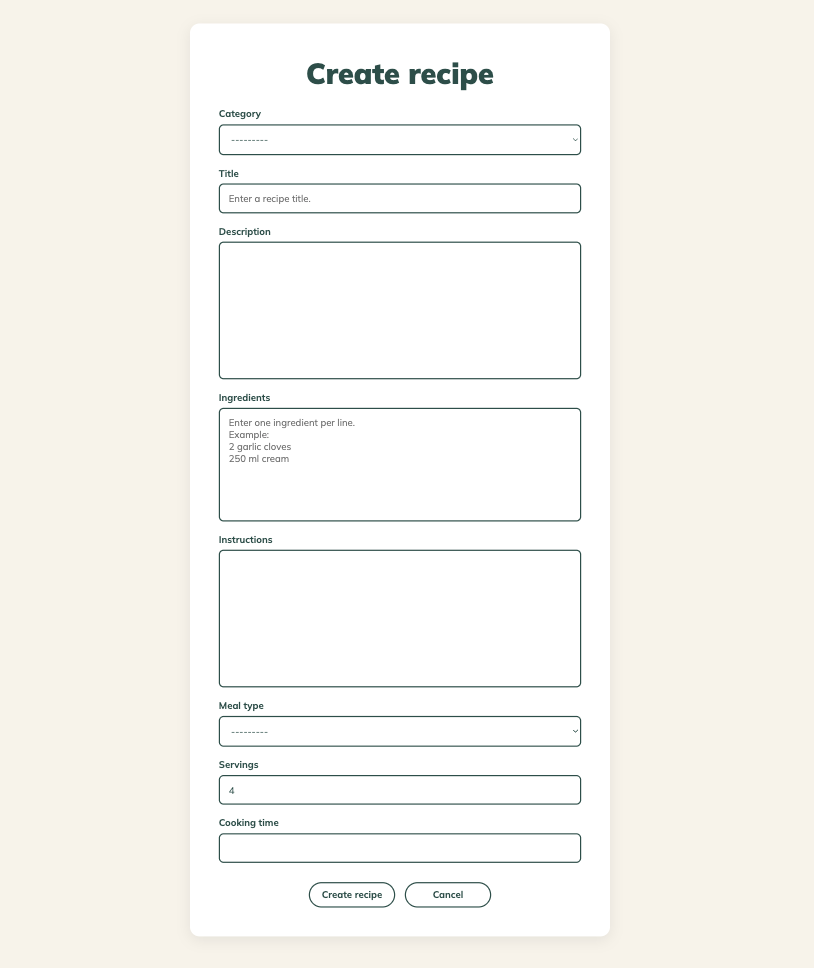
</p>

The following fields are required:

- Category
- Title
- Ingredients
- Instructions
- Meal type
- Cooking time

If a required field is left empty, the form displays validation feedback and prevents submission until the missing information is provided. The servings field has a default value of **4**, but users can change it before submitting the form.

After successful submission, the recipe is saved to the database, assigned to the logged-in user and displayed on its Recipe Details page. As user-uploaded images are not currently supported, a default image is assigned automatically based on the selected food category: vegetarian, dessert, chicken, meat or fish.

<p align="center">
  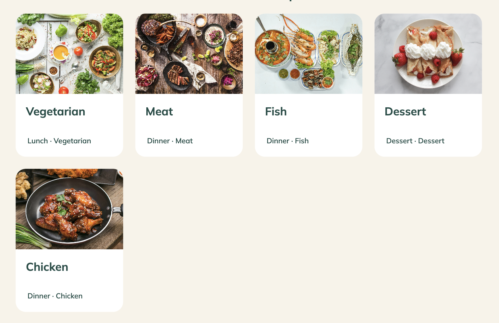
</p>

#### Edit Recipe Page

Recipe authors can edit recipes they have created. The form is pre-filled with the existing recipe information, allowing the user to update any field.

Users can choose to save their changes, cancel the edit and return to the recipe, or delete the recipe. After a successful update, a confirmation message is displayed and the user is redirected to the Recipe Details page.


<p align="center">
  
</p>

<p align="center">
  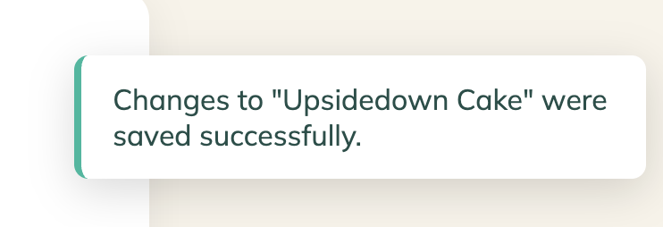
</p>

#### Delete Recipe Action

Only the recipe author can delete a recipe.

Selecting **Delete recipe** opens a confirmation dialog to prevent accidental deletion. If the user confirms the action, the recipe is removed from the database and a success message is displayed. If the user cancels, the recipe remains unchanged.


<p align="center">
  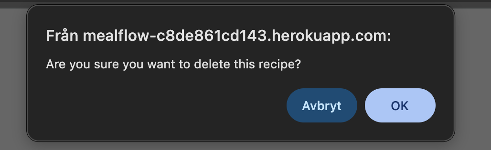
</p>

#### Django Admin

- The Django admin interface is available to authorised administrators and provides central management of the application's data.

- Administrators can create, view, update and delete categories, recipes, ingredients, saved-recipe records and user accounts.

### User Flow

The main user journeys are outlined below. More detailed explanations are provided in the [Features](#features) section.

**Visitors can:**

- Browse, search and filter recipes.
- Open a recipe to view ingredients and instructions.
- Register or log in to access personalised features.

**Registered users can:**

- Save and remove recipes from their collection.
- View saved and created recipes under **My Recipes**.
- Create, edit and delete their own recipes.
- Log out securely.

---
## Skeleton Plane

### Navigation

The main navigation provides access to the core pages of the application and changes according to the user's authentication status.

On smaller screens, it is replaced by an accessible hamburger menu that updates its icon, `aria-expanded` state and label when opened or closed.

### Layout and Interface

MealFlow uses:

- A shared base template with a consistent header and footer.
- Reusable recipe cards and button styles.
- Responsive grid layouts.
- Clearly separated content sections.
- Accessible forms with labels, fieldsets and validation feedback.
- A mobile-first layout that adapts across mobile, tablet and desktop screen sizes.

---
## Surface Plane

### Colour Scheme

The colour scheme was designed to feel warm, natural and welcoming. The palette was created using [Coolors](https://coolors.co/2d2d2d-6a9e6f-f4a261-87ceeb-faf9f6).

<p align="center">
  
</p>

The main colours are stored as CSS custom properties to maintain consistency across the application:

```css
--color-background: #f8f3ea;
--color-primary: #1b4e47;
--color-secondary: #07bba0;
--color-surface: #ffffff;
```
Additional colours are used for action buttons, destructive actions, borders and validation feedback:

```css
--color-accent: #be435c;
--color-danger: #bc0202;
--color-border: #cfcfcf;
```

<p align="center">
  
</p>

### Typography

The **Mulish** typeface is used throughout MealFlow to create a clean, modern and readable interface across different screen sizes.

### Responsive Design

MealFlow was developed using a mobile-first approach and adapts across mobile, tablet, laptop and desktop screen sizes.

Responsive features include a hamburger menu, flexible forms, scalable images, responsive recipe grids and adjusted spacing and typography.

Detailed responsive testing can be found in [TESTING.md](TESTING.md).

### Accessibility

Accessibility considerations include:

- Semantic HTML elements.
- A skip link for keyboard users.
- Visually hidden labels where required.
- Descriptive labels for form controls.
- Fieldsets and legends for filter groups.
- Alternative text for recipe images.
- Keyboard-accessible buttons and links.
- Visible focus indicators.
- ARIA attributes for the navigation toggle.
- An `aria-live` region for feedback messages.
- Sufficient colour contrast.
- Confirmation before recipe deletion.

---

# User Stories
## Visitor User Stories

| User Story | Outcome |
|---|---|
| As a visitor, I want to understand the purpose of the website so that I know what MealFlow offers. | The Home page contains a clear introduction and recipe collection. |
| As a visitor, I want to browse available recipes so that I can discover new meal ideas. | Recipe cards are displayed on the Home page. |
| As a visitor, I want to search by recipe title so that I can quickly find a specific recipe. | The Home page includes a title search field. |
| As a visitor, I want to filter recipes so that I can find recipes that suit my needs. | Recipes can be filtered by meal type and food category. |
| As a visitor, I want to view full recipe details so that I can prepare the meal. | Each recipe has a dedicated Recipe Details page. |
| As a visitor, I want to return to the recipe collection so that I can continue browsing. | A **Back to recipes** button links to the Home page. |
| As a visitor, I want to register for an account so that I can save and create recipes. | A Registration page is available. |
| As a visitor, I want to log in so that I can access personalised features. | A Login page is available. |

## Registered User Stories

| User Story | Outcome |
|---|---|
| As a registered user, I want to save recipes so that I can find them again later. | Recipes can be added to the user's saved collection. |
| As a registered user, I want to remove saved recipes so that I can manage my collection. | Saved recipes can be removed without reloading the page. |
| As a registered user, I want to view my saved recipes so that they are available in one place. | Saved recipes appear on the My Recipes page. |
| As a registered user, I want to create recipes so that I can contribute my own content. | Authenticated users can create recipes. |
| As a registered user, I want newly created recipes to appear immediately so that I can access them without delay. | New recipes appear on the Home and My Recipes pages after creation. |
| As a registered user, I want to edit my recipes so that I can correct or improve them. | Recipe authors can edit their own recipes. |
| As a registered user, I want to delete my recipes so that I can remove content I no longer want. | Recipe authors can delete their own recipes. |
| As a registered user, I want a warning before deletion so that I do not remove a recipe accidentally. | A JavaScript confirmation dialog is displayed. |
| As a registered user, I want feedback after completing an action so that I know it succeeded. | Toast-style feedback is displayed after saving, creating, editing or deleting a recipe. |
| As a registered user, I want to log out so that my account remains secure. | A Logout option is available in the navigation. |
## Administrator User Stories

| User Story | Outcome |
|---|---|
| As an administrator, I want to manage recipe categories so that the available options remain accurate. | Categories can be managed through Django admin. |
| As an administrator, I want to manage recipes so that inappropriate or incorrect content can be updated or removed. | Recipes can be managed through Django admin. |
| As an administrator, I want to view recipe ingredients alongside recipes so that recipe content is easier to manage. | Ingredients are displayed as an inline section in the recipe admin interface. |
| As an administrator, I want to manage saved-recipe relationships so that database records can be reviewed. | SavedRecipe records are available in Django admin. |


## Future Features

Possible future improvements include:

- User-uploaded recipe images.
- Ratings, reviews and recipe comments.
- Nutritional information.
- Ingredient scaling based on servings.
- Additional filters for preparation time and difficulty.
- User profile pages.
- Saved recipe collections and meal planning.
- Recipe sharing and shopping-list generation.
- Email-based password reset.
- Custom 404 and 500 error pages.
- Pagination or infinite scrolling for larger recipe collections.

---

# Data Model

MealFlow uses a relational database together with Django's built-in `User` model.

The main application models are described below.

## Category

The `Category` model stores recipe categories and their fallback images.

| Field | Type | Purpose |
|---|---|---|
| `name` | CharField | Category name |
| `slug` | SlugField | URL-safe category value |
| `default_image` | CharField | Static fallback image path |

## Recipe

The `Recipe` model stores the main recipe data.

| Field | Type | Purpose |
|---|---|---|
| `author` | ForeignKey | User who created the recipe |
| `category` | ForeignKey | Related recipe category |
| `title` | CharField | Recipe title |
| `description` | TextField | Short recipe description |
| `instructions` | TextField | Cooking instructions |
| `meal_type` | CharField | Breakfast, lunch, dinner or dessert |
| `servings` | PositiveIntegerField | Number of servings |
| `cooking_time` | PositiveIntegerField | Total cooking time in minutes |
| `image_name` | CharField | Optional static image filename |
| `created_at` | DateTimeField | Creation timestamp |
| `updated_at` | DateTimeField | Last update timestamp |

## Ingredient

The `Ingredient` model stores individual ingredients linked to a recipe.

| Field | Type | Purpose |
|---|---|---|
| `recipe` | ForeignKey | Related recipe |
| `name` | CharField | Ingredient name |
| `quantity` | CharField | Ingredient quantity |
| `order` | PositiveIntegerField | Display order |

## SavedRecipe

The `SavedRecipe` model connects users with recipes they have saved.

| Field | Type | Purpose |
|---|---|---|
| `user` | ForeignKey | User who saved the recipe |
| `recipe` | ForeignKey | Saved recipe |
| `saved_at` | DateTimeField | Date the recipe was saved |

A unique database constraint prevents the same user from saving the same recipe more than once.


---
