# Testing

MealFlow was tested throughout development to confirm that the application works as intended across different pages, screen sizes, browsers and user states.

---

# Code Validation

## HTML Validation

All rendered pages were tested using the [W3C Nu HTML Checker](https://validator.w3.org/nu/).

Django template files contain template syntax and were therefore tested through their rendered deployed pages.
See links below.

| Page | Result |
|---|---|
| Home | [Passed](https://validator.w3.org/nu/?doc=https%3A%2F%2Fmealflow-c8de861cd143.herokuapp.com%2F) |
| Recipe Details | [Passed](https://validator.w3.org/nu/?doc=https%3A%2F%2Fmealflow-c8de861cd143.herokuapp.com%2Frecipe%2F1%2F) |
| Register | [Passed](https://validator.w3.org/nu/?doc=https%3A%2F%2Fmealflow-c8de861cd143.herokuapp.com%2Fregister) |
| Login | [Passed](https://validator.w3.org/nu/?doc=https%3A%2F%2Fmealflow-c8de861cd143.herokuapp.com%2Flogin) |
| My Recipes | [Passed](https://validator.w3.org/nu/?doc=https%3A%2F%2Fmealflow-c8de861cd143.herokuapp.com%2Fmy-recipes%2F) |
| Create Recipe | [Passed](https://validator.w3.org/nu/?doc=https%3A%2F%2Fmealflow-c8de861cd143.herokuapp.com%2Fcreate-recipe%2F) |
| Edit Recipe | [Passed](https://validator.w3.org/nu/?useragent=Validator.nu%2FLV+https%3A%2F%2Fvalidator.w3.org%2Fservices&acceptlanguage=&doc=https%3A%2F%2Fmealflow-c8de861cd143.herokuapp.com%2Frecipe%2F1%2Fedit%2F) |

All tested pages passed without errors or warnings.

---

## CSS Validation

The deployed stylesheet was tested using the [W3C Jigsaw CSS Validator](https://jigsaw.w3.org/css-validator/).
See links below.


| Page | Result |
|---|---|
| Home | [Passed](https://jigsaw.w3.org/css-validator/validator?uri=https%3A%2F%2Fmealflow-c8de861cd143.herokuapp.com%2F&profile=css3svg&usermedium=all&warning=1&vextwarning=&lang=sv) |
| Recipe Details | [Passed](https://jigsaw.w3.org/css-validator/validator?uri=https%3A%2F%2Fmealflow-c8de861cd143.herokuapp.com%2Frecipe%2F1%2F&profile=css3svg&usermedium=all&warning=1&vextwarning=&lang=sv) |
| Register | [Passed](https://jigsaw.w3.org/css-validator/validator?uri=https%3A%2F%2Fmealflow-c8de861cd143.herokuapp.com%2Fregister%2F&profile=css3svg&usermedium=all&warning=1&vextwarning=&lang=sv) |
| Login | [Passed](https://jigsaw.w3.org/css-validator/validator?uri=https%3A%2F%2Fmealflow-c8de861cd143.herokuapp.com%2Flogin%2F&profile=css3svg&usermedium=all&warning=1&vextwarning=&lang=sv) |
| My Recipes | [Passed](https://jigsaw.w3.org/css-validator/validator?uri=https%3A%2F%2Fmealflow-c8de861cd143.herokuapp.com%2Fmy-recipes%2F&profile=css3svg&usermedium=all&warning=1&vextwarning=&lang=sv) |
| Create Recipe | [Passed](https://jigsaw.w3.org/css-validator/validator?uri=https%3A%2F%2Fmealflow-c8de861cd143.herokuapp.com%2Fcreate-recipe%2F&profile=css3svg&usermedium=all&warning=1&vextwarning=&lang=sv) |
| Edit Recipe | [Passed](https://jigsaw.w3.org/css-validator/validator?uri=https%3A%2F%2Fmealflow-c8de861cd143.herokuapp.com%2Frecipe%2F1%2Fedit%2F&profile=css3svg&usermedium=all&warning=1&vextwarning=&lang=sv) |

The stylesheet passed without errors or warnings.

---

## JavaScript Validation

The JavaScript file was tested using [JSHint](https://jshint.com/).

The project uses ES8 features, including `const`, `let`, arrow functions and asynchronous functions. The following directive was therefore added at the beginning of the JavaScript file:

```js
/* jshint esversion: 8 */
```

The file passed without errors or warnings. JSHint displayed code metrics only.

<p align="center">
  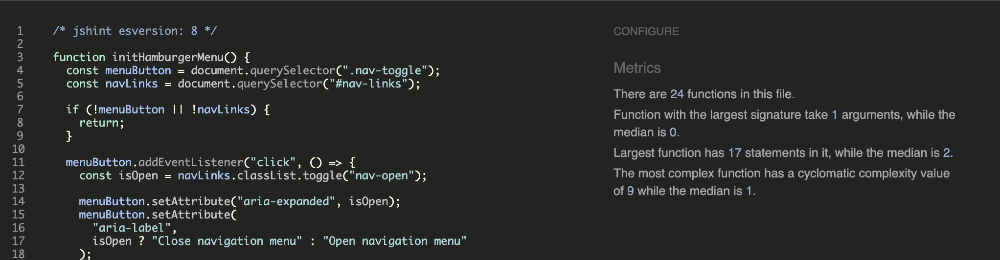
</p>

---

## Python Validation

The project's custom Python files were tested using the [Code Institute Python Linter](https://pep8ci.herokuapp.com/) to check compliance with PEP8 conventions.

| File                 | Validation Result                                                                                                          |
| -------------------- | -------------------------------------------------------------------------------------------------------------------------- |
| `mealflow/admin.py`  | 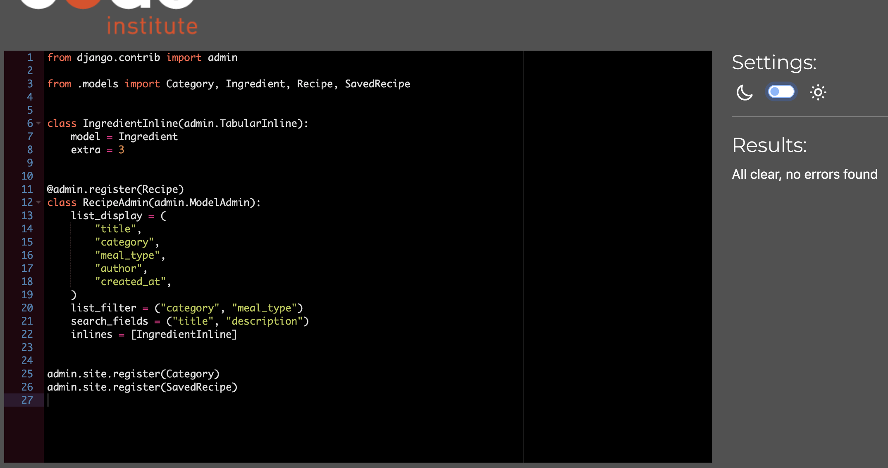   |
| `mealflow/forms.py`  | 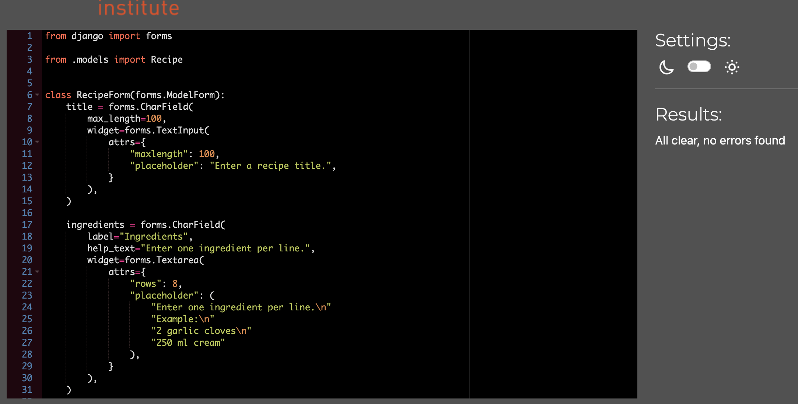   |
| `mealflow/models.py` | 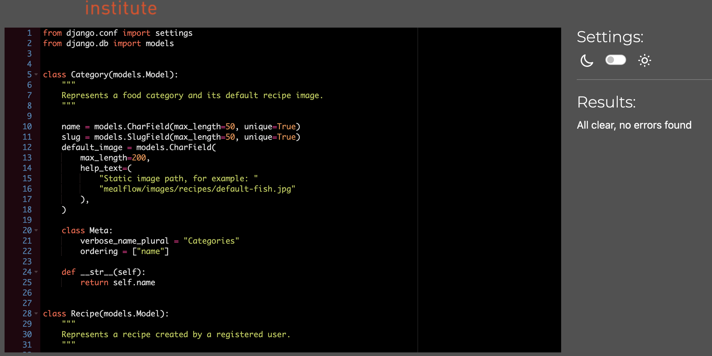 |
| `mealflow/urls.py`   | 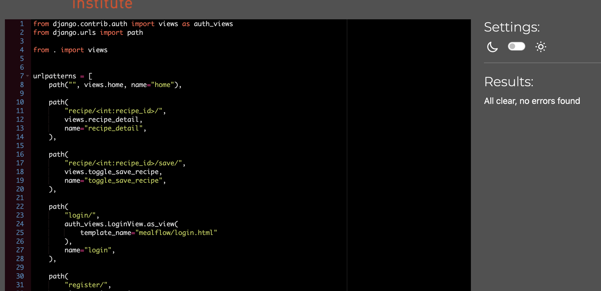     |
| `mealflow/views.py`  | 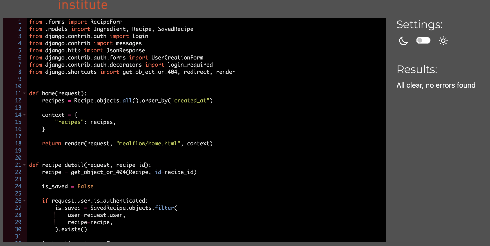   |

All tested files passed without remaining PEP8 errors or warnings.

---

## Django System Checks

Django's built-in system check was run from the project terminal:

```bash
python manage.py check
```

Expected successful result:

```text
System check identified no issues (0 silenced).
```
Result:

<p align="center">
  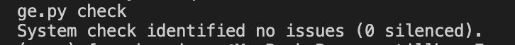
</p>

The project was also checked for model changes without migrations:

```bash
python manage.py makemigrations --check
```

Expected successful result:

```text
No changes detected
```
Result:

<p align="center">
  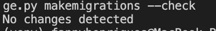
</p>

---

# Lighthouse Testing

Google Lighthouse was used to evaluate the deployed application in the following areas:

- Performance
- Accessibility
- Best Practices
- SEO

See results below.

Homepage: 

<p align="center">
  
</p>

Login page:

<p align="center">
  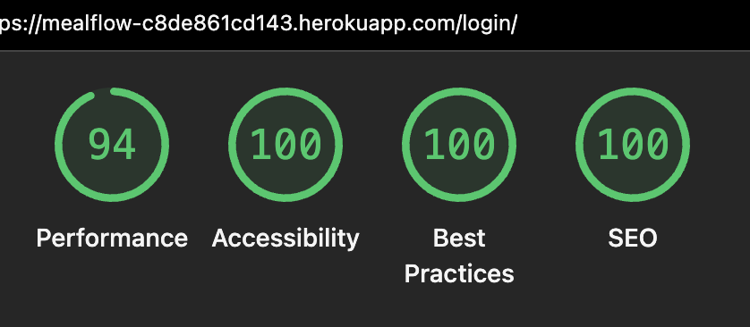
</p>

Register page: 

<p align="center">
  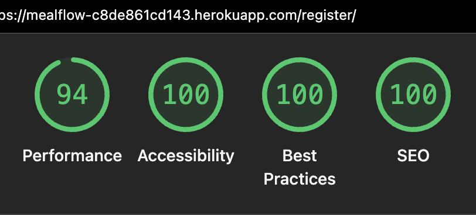
</p>

My Recipes page: 

<p align="center">
  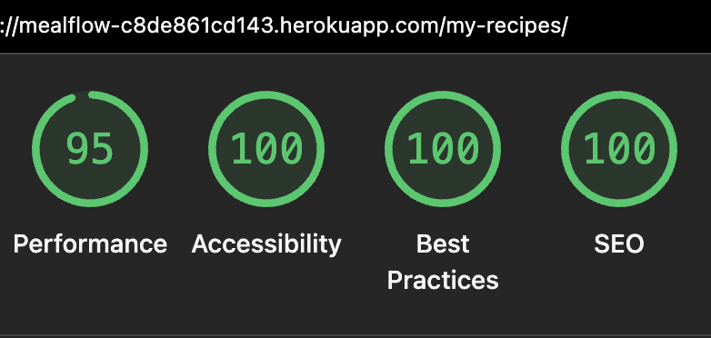
</p>

Create Recipe page: 

<p align="center">
  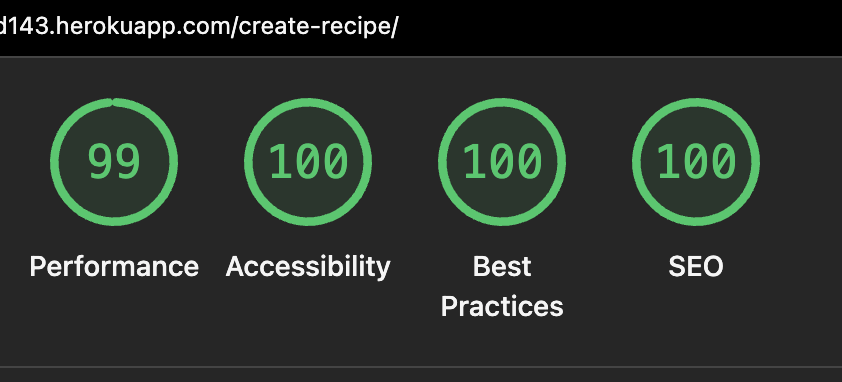
</p>

Details page: 

<p align="center">
  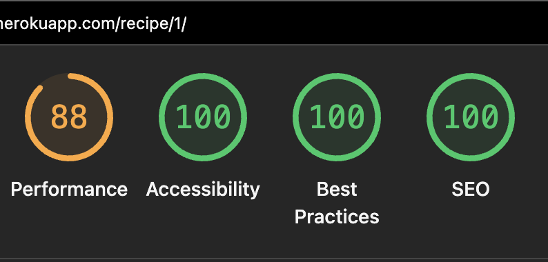
</p>

Performance scores varied slightly between test runs. The Recipe Details page achieved a slightly lower performance score because the main recipe image is displayed above the fold and is intentionally loaded with high priority to improve the user experience. While this can have a small impact on the initial page load performance, it ensures that the primary page content is visible immediately. To minimise layout shifts, explicit image dimensions were defined, and non-critical images elsewhere in the application are loaded lazily where appropriate.

---

# Manual Feature Testing

## Visitor Features

| Feature | Test | Expected Result | Actual Result | Status |
|---|---|---|---|---|
| Open the Home page | Visit the deployed website | The introduction, navigation, search area and recipe grid are displayed | Worked as expected | Pass |
| Browse recipes | View the recipe grid | Available recipes are displayed as recipe cards | Worked as expected | Pass |
| Open a recipe | Select a recipe card | The corresponding Recipe Details page opens | Worked as expected | Pass |
| Return to recipes | Select **Back to recipes** | The user returns to the Home page | Worked as expected | Pass |
| Search by title | Enter all or part of a recipe title | Matching recipe cards remain visible | Worked as expected | Pass |
| Filter by meal type | Select one or more meal-type filters | Matching recipes are displayed immediately | Worked as expected | Pass |
| Filter by category | Select one or more category filters | Matching recipes are displayed immediately | Worked as expected | Pass |
| Combine filters | Select meal-type and category filters | Only recipes matching the combined criteria are shown | Worked as expected | Pass |
| Clear search and filters | Select **Clear** | The search field and selected filters are reset | Worked as expected | Pass |
| No matching results | Enter a search term with no matching recipes | A clear no-results message is displayed | Worked as expected | Pass |
| Load more recipes | Select **Load more** when more than 16 matching recipes exist | Up to 16 additional recipes are displayed | Worked as expected | Pass |
| Save while logged out | Select **Log in to save recipe** | The Login page opens | Worked as expected | Pass |


**Example screenshots:**

| Search                                                                                                          | Filters                                                                                                                  | Load More                                                                                                       |
| --------------------------------------------------------------------------------------------------------------- | ------------------------------------------------------------------------------------------------------------------------ | --------------------------------------------------------------------------------------------------------------- |
|  |  | 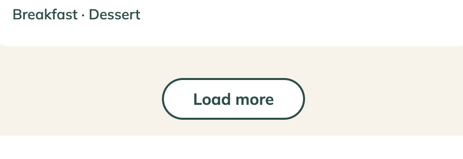 |

---

## Authentication

| Feature | Test | Expected Result | Actual Result | Status |
|---|---|---|---|---|
| Open Registration page | Select **Register** in the navigation | The Registration form opens | Worked as expected | Pass |
| Register valid account | Submit a valid username and matching passwords | The account is created, the user is logged in and redirected to Home | Worked as expected | Pass |
| Invalid registration | Submit invalid information | Validation feedback is displayed | Worked as expected | Pass |
| Password mismatch | Enter two different passwords | The account is not created and an error is displayed | Worked as expected | Pass |
| Open Login page | Select **Login** | The Login form opens | Worked as expected | Pass |
| Valid login | Submit correct credentials | The user is authenticated and redirected | Worked as expected | Pass |
| Invalid login | Submit incorrect credentials | An error message is displayed | Worked as expected | Pass |
| Authenticated navigation | Log in successfully | **My Recipes**, **Add Recipe** and **Logout** are displayed | Worked as expected | Pass |
| Logout | Select **Logout** | The user is logged out and visitor navigation is restored | Worked as expected | Pass |


**Example screenshots:**

| Registration validation                                                                                                                 | Login validation                                                                                                                 |
| --------------------------------------------------------------------------------------------------------------------------------------- | -------------------------------------------------------------------------------------------------------------------------------- |
|  |  |

---

## Saved Recipes

| Feature | Test | Expected Result | Actual Result | Status |
|---|---|---|---|---|
| Save recipe | Select **Save recipe** | The button changes to **Saved** and feedback is displayed | Worked as expected | Pass |
| Remove saved recipe | Select **Saved** again | The recipe is removed and the button returns to **Save recipe** | Worked as expected | Pass |
| Save without page reload | Save or remove a recipe | The button and feedback update without a full reload | Worked as expected | Pass |
| View saved recipes | Open **My Recipes** after saving a recipe | The saved recipe appears in the saved section | Worked as expected | Pass |
| Empty saved section | Open **My Recipes** without saved recipes | **You have not saved any recipes yet.** is displayed | Worked as expected | Pass |
| Prevent duplicate saves | Save the same recipe more than once | Only one saved relationship exists | Worked as expected | Pass |

**Example screenshots:**

| Save recipe                                                                                                                | Remove saved recipe                                                                                                                 |
| -------------------------------------------------------------------------------------------------------------------------- | ----------------------------------------------------------------------------------------------------------------------------------- |
| 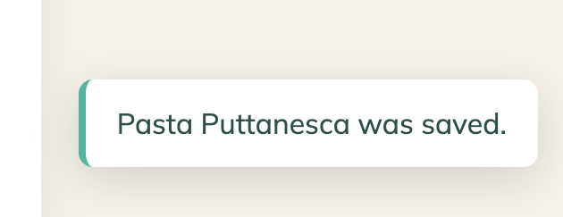 | 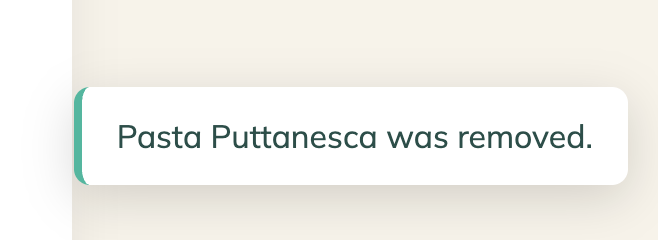 |

| Saved recipes                                                                                                    | Empty saved recipes                                                                                                            |
| ---------------------------------------------------------------------------------------------------------------- | ------------------------------------------------------------------------------------------------------------------------------ |
|  |  |

---

## Recipe CRUD

### Create

| Test | Expected Result | Actual Result | Status |
|---|---|---|---|
| Open Create Recipe page | The recipe form is displayed | Worked as expected | Pass |
| Submit a valid recipe | The recipe is saved and its details page opens | Worked as expected | Pass |
| View newly created recipe | The recipe appears on Home and My Recipes | Worked as expected | Pass |
| Leave a required field empty | Submission is prevented and validation feedback is shown | Worked as expected | Pass |
| Enter ingredients on separate lines | Ingredients appear as separate list items | Worked as expected | Pass |
| Leave servings unchanged | The default value of 4 is saved | Worked as expected | Pass |
| Create recipe without an uploaded image | A default image is selected from its category | Worked as expected | Pass |


**Example screenshots:**

| Leave required field empty                                                                                                         | Newly Created Recipe                                                                                                             |
| -------------------------------------------------------------------------------------------------------------------------- | -------------------------------------------------------------------------------------------------------------------------------- |
| 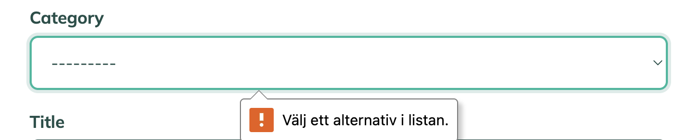 | 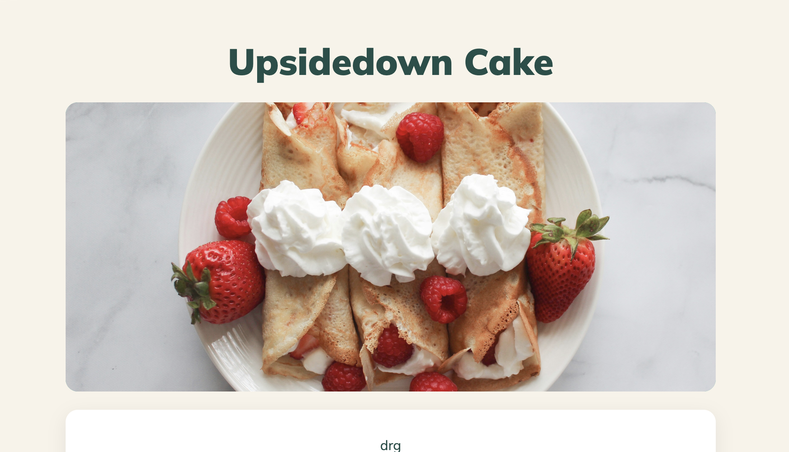 |


### Read

| Test | Expected Result | Actual Result | Status |
|---|---|---|---|
| Open a recipe card | The correct recipe title, image and information are displayed | Worked as expected | Pass |
| View ingredients | All stored ingredients are displayed | Worked as expected | Pass |
| View instructions | Instructions are displayed as ordered steps | Worked as expected | Pass |
| View recipe metadata | Category, cooking time and servings are displayed | Worked as expected | Pass |

**Example screenshots:**

| Recipe Overview                                                                                                                         | Ingredients and Instructions                                                                                                                            |
| --------------------------------------------------------------------------------------------------------------------------------------- | ------------------------------------------------------------------------------------------------------------------------------------------------------- |
|  |  |


### Update

| Test | Expected Result | Actual Result | Status |
|---|---|---|---|
| Open own recipe for editing | The form opens with the existing data | Worked as expected | Pass |
| Save valid changes | The changes are stored and displayed on the details page | Worked as expected | Pass |
| Update ingredients | Previous ingredients are replaced with the updated list | Worked as expected | Pass |
| Cancel editing | No new changes are saved | Worked as expected | Pass |
| View success feedback | A confirmation message appears after saving | Worked as expected | Pass |


**Example screenshot:**

| Success Message |
|---|
|  |


### Delete

| Test | Expected Result | Actual Result | Status |
|---|---|---|---|
| Select **Delete recipe** | A confirmation dialog appears | Worked as expected | Pass |
| Cancel deletion | The dialog closes and the recipe remains unchanged | Worked as expected | Pass |
| Confirm deletion | The recipe is removed and success feedback appears | Worked as expected, with the minor issue documented below | Pass with known issue |
| Check Home and My Recipes | The deleted recipe no longer appears | Worked as expected | Pass |

**Example screenshots:**

| Delete Confirmation                                                                                                                 | Deletion Success                                                                                                                     |
| ----------------------------------------------------------------------------------------------------------------------------------- | ------------------------------------------------------------------------------------------------------------------------------------ |
|  |  |

---

## Authorisation

| Test | Expected Result | Actual Result | Status |
|---|---|---|---|
| Open Create Recipe while logged out | The user is redirected to Login | Worked as expected | Pass |
| Open My Recipes while logged out | The user is redirected to Login | Worked as expected | Pass |
| Edit own recipe | The Edit option is available | Worked as expected | Pass |
| Edit another user's recipe through the interface | No Edit option is displayed | Worked as expected | Pass |
| Enter another user's edit URL manually | Access is denied because the recipe is not owned by the current user | Worked as expected | Pass |
| Delete another user's recipe | The recipe cannot be deleted by that user | Worked as expected | Pass |
| Save recipe while authenticated | The recipe can be added to the current user's collection | Worked as expected | Pass |

---

## Administrator Features

| Feature | Test | Expected Result | Actual Result | Status |
|---|---|---|---|---|
| Access Django admin | Log in with an administrator account | The admin dashboard opens | Worked as expected | Pass |
| Manage users | View and update user records | User records can be managed | Worked as expected | Pass |
| Manage categories | Create, edit or remove a category | Category data is updated | Worked as expected | Pass |
| Manage recipes | Create, edit or remove a recipe | Recipe data is updated | Worked as expected | Pass |
| Manage ingredients | Edit ingredients through the Recipe admin | Ingredient data is updated | Worked as expected | Pass |
| Manage saved recipes | View or remove SavedRecipe records | Saved relationships can be managed | Worked as expected | Pass |

---

# User Story Testing

The user stories defined in the README were tested through the application's main user journeys.

## Visitor User Stories

| User Story | Test Result | Status |
|---|---|---|
| Understand the purpose of MealFlow | The Home page presents an introduction and recipe collection | Pass |
| Browse available recipes | Recipe cards are visible on the Home page | Pass |
| Search for a recipe | Recipe cards update according to the search term | Pass |
| Filter recipes | Meal-type and category filters update the grid | Pass |
| View full recipe details | Selecting a card opens its details page | Pass |
| Return to the recipe collection | **Back to recipes** returns the visitor to Home | Pass |
| Register for an account | A valid account can be created | Pass |
| Log in | Valid credentials provide access to authenticated features | Pass |

## Registered User Stories

| User Story | Test Result | Status |
|---|---|---|
| Save recipes | A recipe can be added to the saved collection | Pass |
| Remove saved recipes | A saved recipe can be removed without reloading | Pass |
| View saved recipes | Saved recipes are displayed under My Recipes | Pass |
| Create a recipe | A valid recipe can be saved to the database | Pass |
| See a new recipe immediately | The new recipe appears on Home and My Recipes | Pass |
| Edit an owned recipe | The author can update the recipe | Pass |
| Delete an owned recipe | The author can remove the recipe | Pass with known issue |
| Receive a deletion warning | A confirmation dialog appears before deletion | Pass |
| Receive feedback | Confirmation messages appear after important actions | Pass |
| Log out | The authenticated session ends successfully | Pass |

## Administrator User Stories

| User Story | Test Result | Status |
|---|---|---|
| Manage categories | Categories can be managed through Django admin | Pass |
| Manage recipes | Recipes can be managed through Django admin | Pass |
| Manage ingredients | Ingredients can be managed inline with recipes | Pass |
| Manage saved recipe records | SavedRecipe records are available in Django admin | Pass |


---

# Form Validation

| Form | Test | Expected Result | Status |
|---|---|---|---|
| Registration | Leave required fields empty | Submission is prevented | Pass |
| Registration | Enter mismatched passwords | An error is displayed | Pass |
| Registration | Enter an invalid password | Django displays password validation feedback | Pass |
| Login | Leave credentials empty | Submission is prevented | Pass |
| Login | Enter incorrect credentials | An error is displayed | Pass |
| Create Recipe | Leave required fields empty | Submission is prevented and the missing fields are identified | Pass |
| Create Recipe | Enter valid details | The recipe is saved | Pass |
| Edit Recipe | Submit valid changes | The recipe is updated | Pass |
| Search | Enter text within the permitted length | Matching recipes are displayed | Pass |
| Delete Recipe | Cancel the confirmation dialog | The recipe remains unchanged | Pass |

---

# Responsive Design Testing

# Browser Compatibility

# Accessibility Testing

# Bugs

## Fixed Bugs

## Known Bugs

